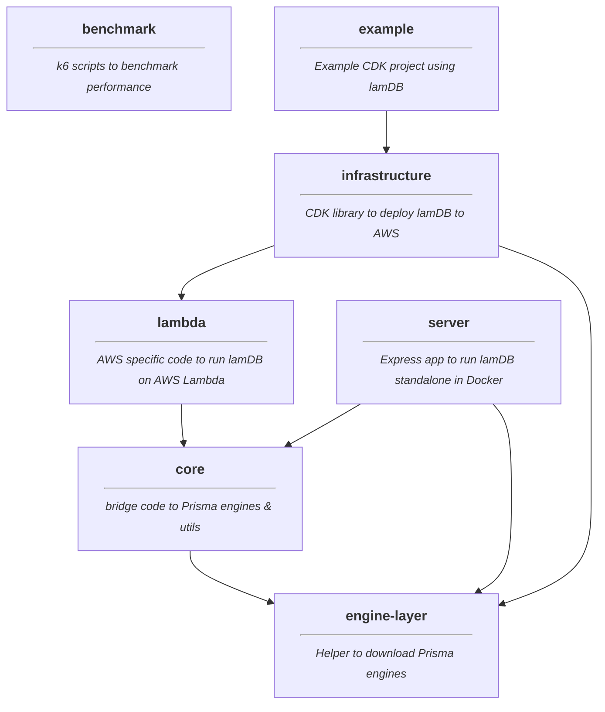

# Architecture

Here is outlined how lamDB is built under the hood.

## Overview

- Running on AWS Lambda with Lambda Layer
- SQLite as underlaying database technology
- SQLite file is persisted to AWS EFS
- Internal Prisma APIs to provide GraphQL interface and migrations
- Query optimizations to provide support for GraphQL language features, Prisma does not support

## Packages

LamDB uses a monorepo to easily share code between components and publish them all at once.
Some of the packages are internally, some can be used to launch a lamDB instance. Here is a summary of what packages exist and how they are used.

As you can see by the `example` package, the only real dependency one should use is the `@lamdb/infrastructure` package. It comes with everything required to deploy lamDB to AWS.

One could also use `@lamdb/server` in case they want a standalone server instance of lamDB outside AWS.

Every other package is just there to simplify the interactions and streamline communication.

Find more relevant information in the respective READMEs of the packages.

## Prisma

LamDB makes use of Prisma's internal APIs and libraries. Prisma discourages using their internal libraries and even the [engines](https://www.prisma.io/docs/concepts/components/prisma-engines), because they might introduce unforseeable breaking changes internally.

This is fine for lamDB. We pin versions of internal dependencies as much as possible and execute integration tests to ensure everthing is still compatible. Also, because we are using internal packages by Prisma the usage of the binary engines is abstracted by Prisma already.

LamDB generally tries to use the Prisma provided NPM packages as much as possible to avoid reimplementing and misunderstanding communication with their Prisma engines.

### Query Engine

The Query Engine is the heart of executing GraphQL requests against the SQLite database.

LamDB uses Prisma's package to communicate with the binary engine. Beforehand some optimizations are done on the request payload, because the query engine does not support all GraphQL language features, like variables. LamDB tries to optimize the operations to fit into query engines capabilities, because when not using the official `@prisma/client` to communicate with lamDB, the additional language features are helpful.

### Migration Engine

The Migration Engine takes care to execute migration scripts in order if not yet executed.

The corresponding Prisma package was not used in lamDB but instead the RPC connection is re-implemented to execute the migrations just like Prisma CLI would do.
This is because the provided Prisma package has issues with types and requires WASM dependencies where the location path cannot be specified from outside. It makes it incompatible with running via Lambda layers.
