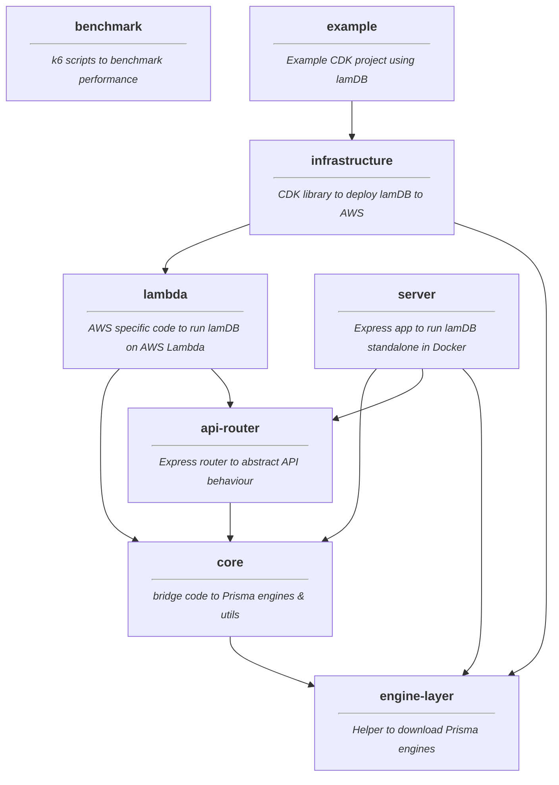

# Packages

LamDB uses a monorepo to easily share code between components and publish them all at once.
Some of the packages are internally, some can be used to launch a lamDB instance. Here is a summary of what packages exist and how they are used.

As you can see by the `example` package, the only real dependency one should use is the `@lamdb/infrastructure` package. It comes with everything required to deploy lamDB to AWS.

One could also use `@lamdb/server` in case they want a standalone server instance of lamDB outside AWS.

Every other package is just there to simplify the interactions and streamline communication.

Find more relevant information in the respective READMEs of the packages.
